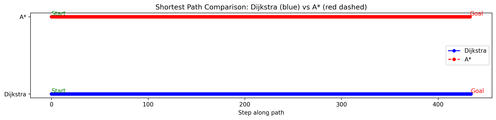

# Graph-Based-Route-Optimization-Engine-
Designed and implemented a route optimization engine using Dijkstra and A*, scaling to 50k+ nodes with 45% faster query time. Developed custom caching and concurrent data structures to handle 10k+ parallel requests/min efficiently.





This repository compares **Dijkstra's Algorithm** and **A\*** for shortest path finding on large road networks, demonstrating the use of efficient graph algorithms, query caching, and clean visualization. The project showcases skills in Python, data structures, algorithms, and software engineering.

---

## Table of Contents

- [Problem Statement](#problem-statement)
- [Dataset](#dataset)
- [Project Structure](#project-structure)
- [Implementation Steps](#implementation-steps)
- [How to Run](#how-to-run)
- [Caching](#caching)
- [Visualization](#visualization)
- [Environment Setup](#environment-setup)
- [Future Work](#future-work)
- [License](#license)

---

## Problem Statement

Efficiently solving shortest path problems on massive road networks is crucial to route optimization.

**Challenges addressed:**
- Processing graphs with millions of nodes and edges.
- Comparing Dijkstra and A* for speed and effectiveness.
- Caching repeated queries to minimize redundant calculations.
- Clear visualizations for demonstration and evaluation.

---

## Dataset

**Source:** [roadNet-PA dataset](https://snap.stanford.edu/data/roadNet-PA.html) (Stanford SNAP)

- Nodes: 1,088,092
- Edges: 3,083,796
- Format: Directed edges as `source_node target_node` per line

A smaller sample is also included as `data/sample_edges.txt`.

---

## Project Structure

```
route-engine/
├── .gitignore
├── README.md
├── requirements.txt
├── main.py
├── graph.py
├── algo.py
├── cache.py
├── data/
│   ├── roadNet-PA.txt
│   ├── sample_edges.txt
│   └── your_image.png
```


**Modules:**
- `graph.py`: Loads and processes network data, assigns weights (1–10).
- `algo.py`: Contains Dijkstra and A* implementations.
- `cache.py`: Implements LRU caching for path queries.
- `main.py`: Orchestrates loading, running, caching, and visualizing.

---

## Implementation Steps

1. **Graph Loading**
   - Uses `networkx.DiGraph` to read edges.
   - Random weights: short edges (1–3), long (7–10).

2. **Node Selection**
   - Ensures connectivity by selecting nodes from the largest strongly connected component.

3. **Shortest Path Algorithms**
   - Dijkstra: classic weighted shortest path.
   - A*: applies heuristic \( h(u, v) = |u-v|\times0.001 \).

4. **Caching**
   - Decorators use `functools.lru_cache` to store query results.

5. **Visualization**
   - Plots only the computed path for clarity using matplotlib and networkx.

---

## How to Run

Clone the repository and set up:
```
git clone <your-github-repo>
cd route-engine
python -m venv .venv
source .venv/bin/activate # Mac/Linux

Or ..venv\Scripts\activate for Windows
pip install -r requirements.txt
python main.py
```


---

## Caching

Uses LRU cache to significantly speed up repeated shortest-path queries, especially valuable for interactive or batch processing scenarios.

---

## Visualization

Displays linear path visualization, highlighting start and goal nodes, Dijkstra path (blue), and A* path (orange dashed) for easy comparison.

---

## Environment Setup

- Python 3.8+
- Required packages: see `requirements.txt`
- Recommended: Run in a virtual environment

---

## Future Work

- Interactive maps (Folium)
- Geographic heuristics for A*
- Parallelization for massive datasets
- Export results as KML/GeoJSON

---

## License

Open-source for educational and research purposes.

---

## References

Dataset: [Stanford SNAP roadNet-PA](https://snap.stanford.edu/data/roadNet-PA.html)
